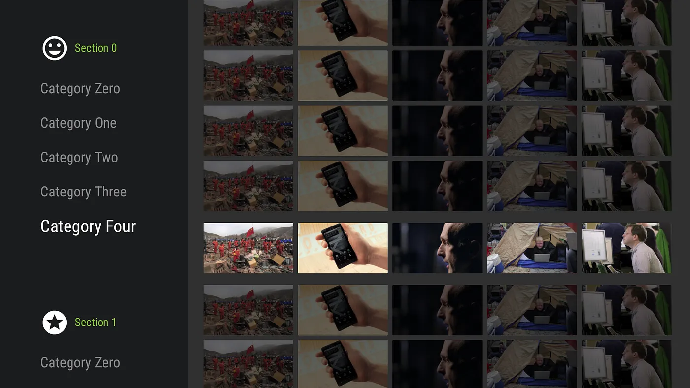

# LeanbackSamples

This repository contains Android TV sample projects on various different topics.

## [MediaSession](https://github.com/ademirqueiroga/leanback-samples/tree/main/MediaSession)

📝 [Check blog post here](https://medium.com/proandroiddev/enhancing-android-tv-playback-experience-with-mediasession-f1554ceae2f1)

In this project we learn about Android MediaSession API, why we should use it, and how to implement it on Android TV (or Fire TV) apps.

## [ChannelSample](https://github.com/ademirqueiroga/leanback-samples/tree/main/ChannelSample)

📝 [Check blog post here](https://medium.com/proandroiddev/android-tv-preview-channels-a-beginners-guide-52621502e996)

Go through a step-by-step guide with some helpful insights on creating and publishing your app's Preview Channels to the Android TV home screen and how to handle user interaction with your channels.

---

## [CustomHeaders](https://github.com/ademirqueiroga/leanback-samples/tree/main/CustomHeaders)

📝 [Check blog post here](https://medium.com/proandroiddev/android-tv-leanback-headerssupportfragment-a-detailed-guide-15afc02732cb)

Understanding the internals of the Leanback APIs is sometimes quite tricky, but it's something we, as developers, must do to make sure we're able to create apps that look and behave correctly to our users. In this project we dive deep into the HeadersSupportFragment, which is part of the BrowseSupportFragment, and almost always, the first piece of content users see in an Android TV app. We will learn about its creation, how it behaves, and how we can customize it.

---

## [rows-update](https://github.com/ademirqueiroga/leanback-samples/tree/main/rows-update)

📝 [Check blog post here](https://medium.com/proandroiddev/android-tv-leanback-updating-rows-in-rowssupportfragment-b407dff3be4d)

In this project we learn how to update the rows of a RowsSupportFragment leveraging the power of the DiffUtil class and how to update only the specific content that changed in the row.

---

## [transport-controls](https://github.com/ademirqueiroga/leanback-samples/tree/main/transport-controls)

📝 [Check blog post here - Part 1](https://medium.com/proandroiddev/android-tv-leanback-playback-controls-part-1-cfbb938a2b89)

📝 [Check blog post here - Part 2](https://medium.com/proandroiddev/android-tv-leanback-playback-controls-customizing-controls-f543e5a20627)

This is a two-part series where we learn how to use the Leanback APIs to implement and customize the transport controls, i.e., media controls and their related content, handle D-Pad key events following Google's Playback controls on TV guidelines, and how you can organize your code without mixing UI and playback logic.

